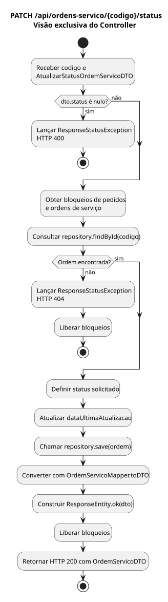

# Diagrama de Atividade - OAT 2

Endpoint escolhido: `PATCH /api/ordens-servico/{codigo}/status` (US02).

Fonte UML editável: [diagrama-atividade.puml](diagrama-atividade.puml).

O diagrama representa exclusivamente `OrdemServicoController.modificarStatus`: validação de status nulo, consulta da OS, retorno 404 quando ausente, alteração, gravação e conversão para DTO antes do retorno 200. As chamadas ao repositório e ao mapper são ações do controller; seus fluxos internos não são detalhados. JSON malformado e valores fora do enum são rejeitados pelo Spring antes da entrada no método e não fazem parte desta visão.
