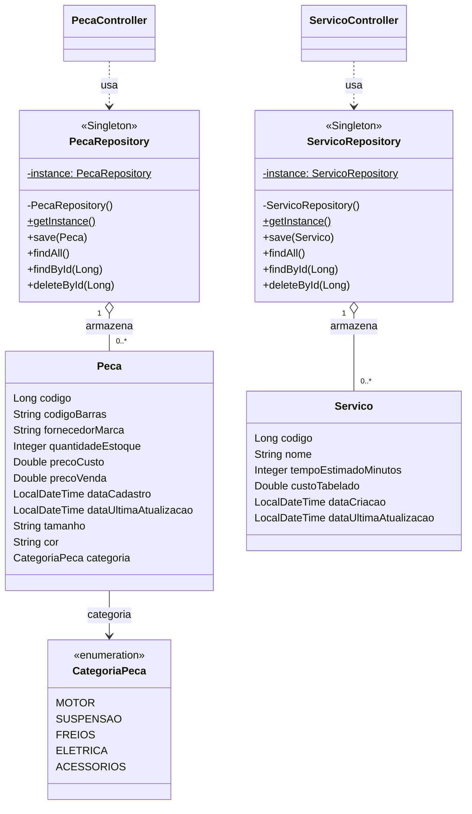

# Diagrama de Classes — OAT 1

```mermaid
classDiagram
    Peca --> CategoriaPeca : categoria
    PecaController ..> PecaRepository : usa
    ServicoController ..> ServicoRepository : usa
    PecaRepository "1" o-- "0..*" Peca : armazena
    ServicoRepository "1" o-- "0..*" Servico : armazena

    class CategoriaPeca {
      <<enumeration>>
      MOTOR
      SUSPENSAO
      FREIOS
      ELETRICA
      ACESSORIOS
    }
    class Peca {
      Long codigo
      String codigoBarras
      String fornecedorMarca
      Integer quantidadeEstoque
      Double precoCusto
      Double precoVenda
      LocalDateTime dataCadastro
      LocalDateTime dataUltimaAtualizacao
      String tamanho
      String cor
      CategoriaPeca categoria
    }
    class Servico {
      Long codigo
      String nome
      Integer tempoEstimadoMinutos
      Double custoTabelado
      LocalDateTime dataCriacao
      LocalDateTime dataUltimaAtualizacao
    }
    class PecaRepository {
      <<Singleton>>
      -instance: PecaRepository$
      -PecaRepository()
      +getInstance()$
      +save(Peca)
      +findAll()
      +findById(Long)
      +deleteById(Long)
    }
    class ServicoRepository {
      <<Singleton>>
      -instance: ServicoRepository$
      -ServicoRepository()
      +getInstance()$
      +save(Servico)
      +findAll()
      +findById(Long)
      +deleteById(Long)
    }
    class PecaController
    class ServicoController
```
