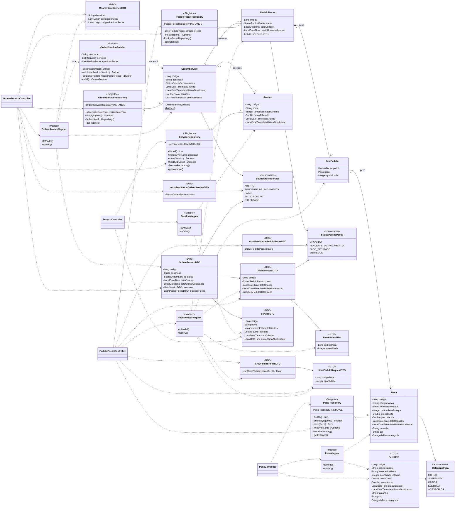

# Diagrama de Classes - OAT 2

`OrdemServicoBuilder` representa a classe estática interna `OrdemServico.Builder`. As associações usam as entidades existentes em memória. Construtores e acessores estão explícitos no código; getters/setters repetitivos foram omitidos do desenho. Os campos e métodos estáticos dos Singletons garantem uma instância de cada repositório.

[Versão PDF do diagrama completo](../mecaniQA_api_Teresina.pdf).
